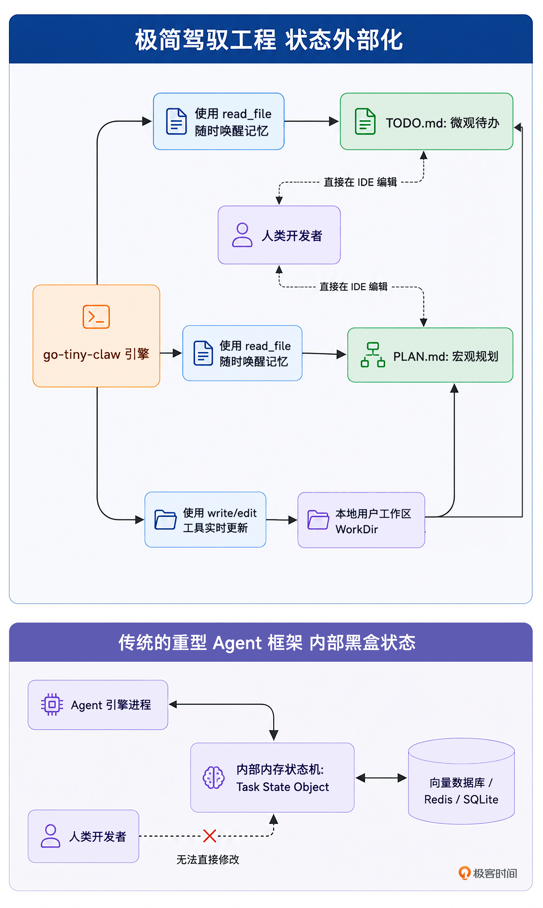
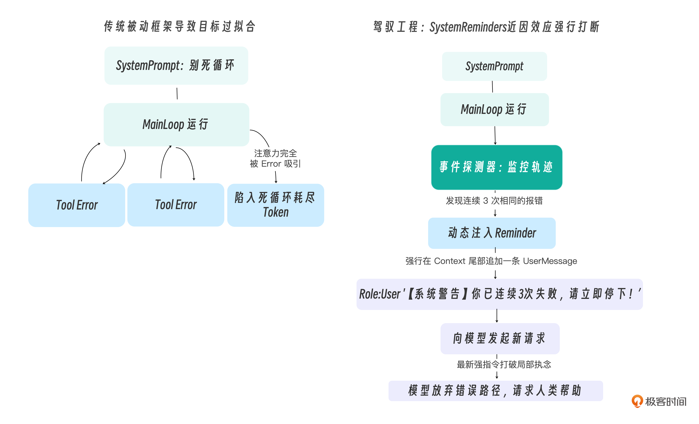
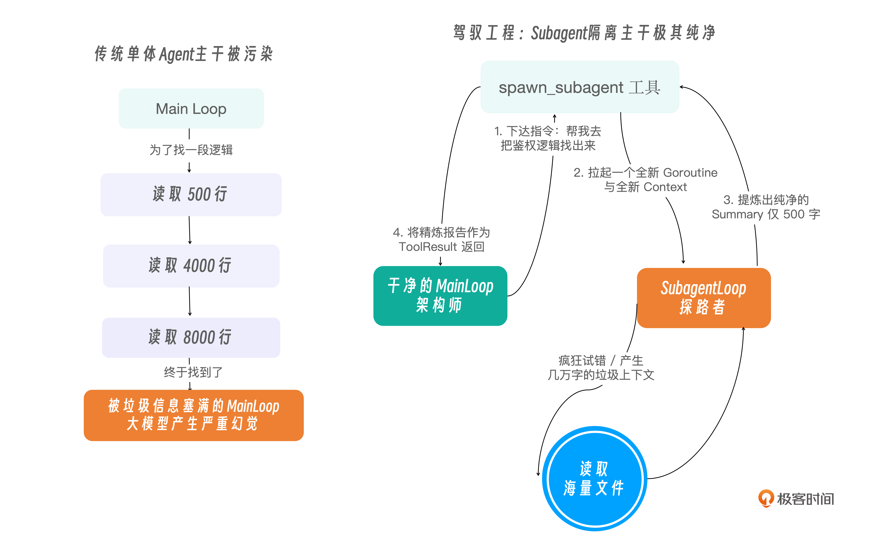
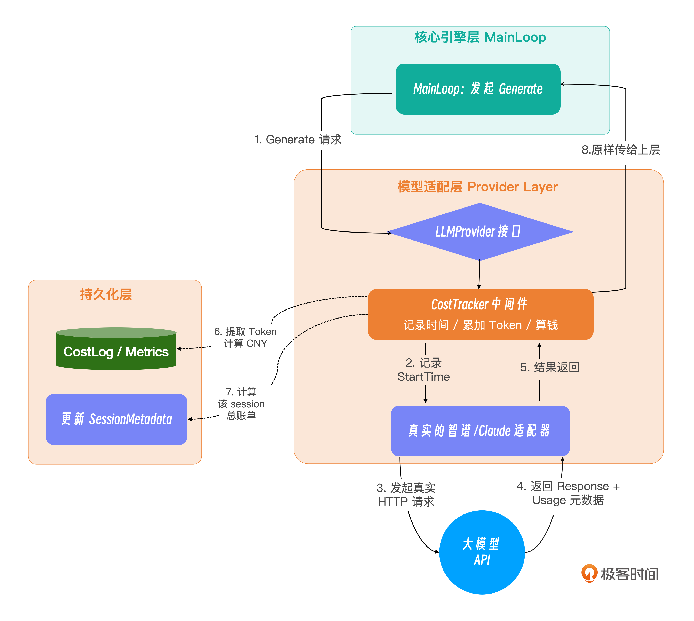
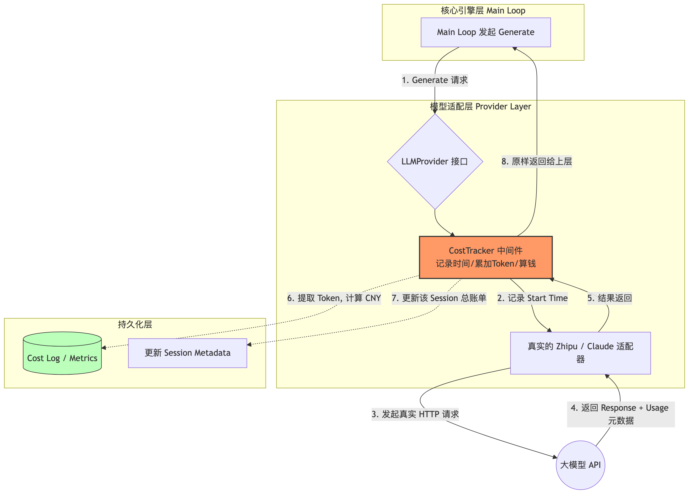
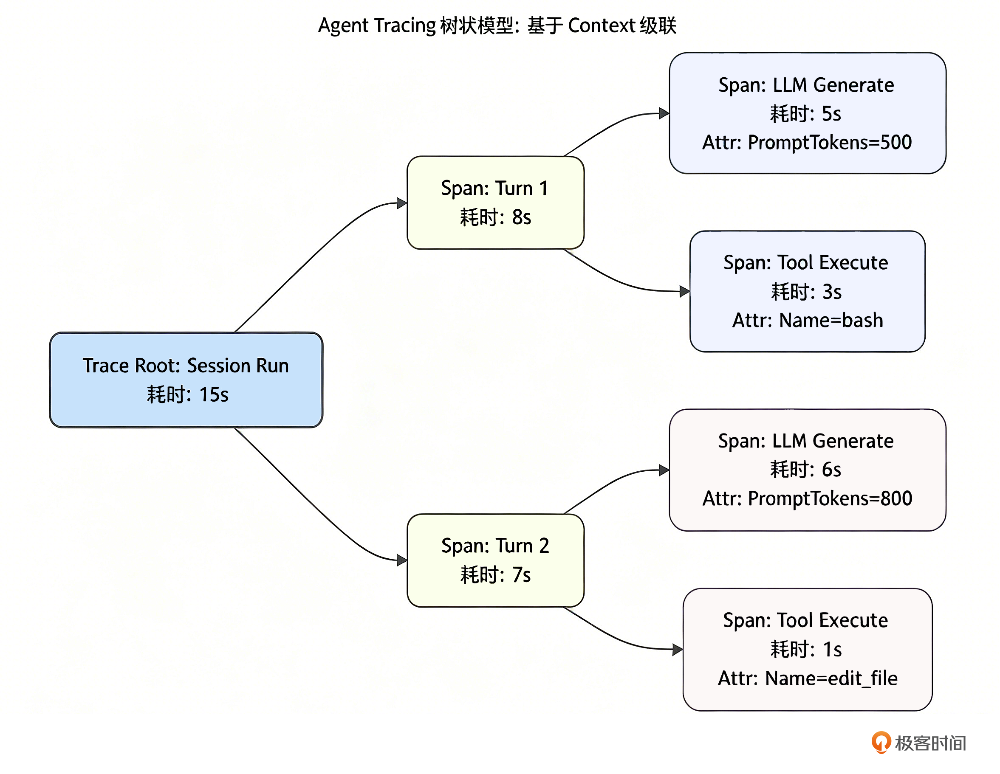

# 从0开始构建 Agent Harness

## OpenClaw 设计

1. 极简工具法则（Minimal Toolset）：当别人都在疯狂集成包含几十个 API 的臃肿 MCP 协议时，OpenClaw 坚信大模型本身足够聪明，因此只暴露 4 个完备的基础原语：Read、Write、Edit 和 Bash。只要给模型一个 bash，它就能自己去运行 git、grep，甚至自己写脚本来解决问题。这就从根源上消灭了工具层面带来的上下文膨胀。
2. 状态外部化（Externalized State）：这是 OpenClaw 的神来之笔。它完全抛弃了在代码内存中维护复杂的任务状态机。相反，它强制 Agent 将数据写在工作区的 Markdown 文件中，比如将宏大的规划写在 PLAN.md 中，将微观的进度写在 TODO.md 中。记忆不再是黑盒，而是人类随时可以打开、阅读甚至手动修改的纯文本。这实现了真正的“零成本人机协同”。
3. YOLO 哲学与防御纵深：在本地开发环境，它奉行 YOLO（You Only Live Once，全权信任）模式，让 Agent 自由狂奔；但同时，它又在底层埋下了坚固的安全中间件（Middleware），用于在部署到远端服务器时，瞬间挂起高危命令，等待人类的审批放行。

## 从 framework 到 harness

需要花更多的时间思考：

- 如何设计一个像 OS GC（垃圾回收）一样的阶梯掩码算法，在不丢失模型意图的前提下，榨干最后一点 Token 空间？
- 如何在底层构建一个安全的防线，让大模型在发疯执行 rm -rf 时被精准拦截？
- 如何为引擎建立科学的链路追踪（Tracing）和自动化度量（Benchmark）体系，用数据证明你的 Agent 真的变聪明了？


对比两张图，你可以清晰地看到 Harness 的三大革命性转变：

1. 控制反转（IoC）：业务流程的控制权从“Go/Python 代码”完全转移到了“大模型的实时推理和规划”中。代码只提供物理定律（如文件读写和编辑、沙箱执行等），不干涉任务走向。
2. 防线前移：既然大模型是自由的，它就可能犯错或搞破坏。因此 Harness 的核心代码全部集中在了 Middleware（防止搞破坏）和 Compactor（防止内存被撑爆）上。
3. 状态透明：循环只依赖一个单一的数据结构——也就是不断累加的 Context 消息列表。没有任何隐式的树节点或图节点变量。

## go-tiny-claw 架构

结合 Harness 驾驭工程的理念，我将 go-tiny-claw 的架构划分为四个核心层：

- 入口交互层（Entry & UI Layer）：引擎对外的触角。我们将支持终端命令行（CLI）输入，并将其接入飞书。更重要的是，这一层包含了人工审批（Human-in-the-loop）的异步回调机制。
- 核心引擎层（Core Engine Layer）：系统的控制中枢。Main Loop 负责维持 ReAct 循环。旁边的大模型适配器是“大脑接口”，抹平不同大模型（如 Claude 和 OpenAI 兼容）底层 API 的差异。新增的 Thinking 模块则负责在行动前强制模型进行慢思考。
- 上下文工程层（Context Engineering Layer）：决定 Agent 能够跑多远的关键。
  - Prompt 动态组装器：动态拼装模块化的系统规则（如读取 AGENTS.md）
  - Token 监控与阶梯压缩器：像 OS 的内存回收器一样，时刻盯着 Token 水位线触发压缩
  - 运行时事件提醒注入：是防走神的利器，在模型做决定的前一刻注入干预指令
  - 基于文件系统的状态与记忆则是极简哲学的核心——抛弃内部变量，直接把进度写在本地 TODO.md 里
- 工具与执行层（Tool Execution Layer）：挂载了让模型改变物理世界的组件。动态的 ToolRegistry 配合极简工具集（read/write/edit/bash），让模型组合出无限可能。强大的 Middleware 机制则死死把守大门，拦截危险命令并对接审批。


代码项目目录如下：


### 核心引擎层 Main Loop

> 所有顶级的 Agent 引擎（无论是早期的 AutoGPT，还是如今最先进的 Claude Code、OpenClaw），它们表面上看起来像魔法一样能在你的本地项目里来回穿梭、修改代码、执行测试。但在代码的最底层，它们都在跑着一个极其朴素、但极其强健的无限循环。

这个循环，在学术界通常被称为 ReAct (Reason + Act = 思考 + 行动) 范式，而在工程界，我们通常称之为 Agent Loop 或 Main Loop。

将“思考（Reasoning）”与“行动（Acting）”在一个循环中交织起来。ReAct 范式认为，一个真正的智能体，必须像人类解决问题一样，在每次行动前先思考，在每次行动后观察结果：

1. 思考（Reason / Thought）：分析当前拿到的线索，规划下一步的意图。例如：“我看到了 calc.go 这个文件，里面可能有 Bug，下一步我要读取它。”
2. 行动（Act / Action）：向外部环境发出指令。例如：调用 read_file 工具。
3. 观察（Observe / Observation）：外部环境（比如我们的 Harness 引擎）将工具执行的结果返回给模型。例如返回了 calc.go 的具体代码。
4. 然后再回到第 1 步，结合新获得的 Observation 再次思考，形成闭环。


### 慢思考与自省：在 ReAct 循环中剥离独立的 Thinking 阶段

如果你在系统提示词里写：“请你先仔细规划，然后再调用工具”。大模型往往会无视这句话。只要它在上下文的 Schema 里看到了诱人的 bash 或 edit 工具，它的预测概率就会瞬间坍塌，转而生成一段 JSON 参数去调用工具。

如何解决呢？既然提示词管不住它的“手”，那我们就用架构锁住它的“手”！驾驭工程（Harness Engineering）给出的解法是：**机制决定行为**。

> 在每一次大模型采取行动前，Harness 引擎会向它发起一次没有附带任何工具 Schema 的纯文本 API 请求。在这个绝对没有工具诱惑的“小黑屋”里，模型别无选择，只能乖乖地输出一段纯文本的深度推理与规划。等它想清楚了，Harness 会把这段推理记录追加到上下文中，然后再发起第二次附带工具的请求，让它去执行。这就是工业级 Agent 循环中的 Two-Stage ReAct（两阶段 ReAct 循环）。

### 架构演进：Two-Stage ReAct 循环


这个 nil 就是驾驭工程中四两拨千斤的魔法。由于大模型是自回归（Auto-regressive）的，当它在 Phase 1 自己输出了“我应该先用 bash 看看系统日志”这句话并被存入 contextHistory 后，在 Phase 2 时，它自己看到自己说的话，就会顺理成章、毫无幻觉地生成一个调用 bash 的 JSON。这极大降低了模型瞎调工具的概率。

> 自回归：即模型将自己生成的片段作为输入，继续预测下一个输出（Token）

```golang
modelResp, err := e.provider.Generate(ctx, contextHistory, nil)
```


### 动作延伸：构建强扩展性的 Tool Registry 与分发机制

> 一个真正的工业级 Agent，它的使命是改变现实世界，比如：它需要读取本地代码、修改配置、执行终端命令，甚至调用集群的微服务。如果面对成百上千种潜在的工具需求，我们在核心引擎（Main Loop）里用一堆 if-else 或 switch-case 去硬编码每个工具的解析和执行逻辑，代码很快就会变成一座无法维护的垃圾山。

这就是为什么顶级开源 Agent（如 OpenClaw）在底层架构中，都必不可少地引入了一个核心中间件：Tool Registry（工具注册表）。

Tool Registry 扮演了一个极其关键的“集线器（Hub）”和“路由器（Router）”的角色。它的核心职责有三：

1. *动态挂载（Register）*：允许开发者在引擎启动时，随时随地向系统插拔新的工具实现（在 Go 中，其本质上是实现了特定 Go 接口的结构体）。
2. *描述暴露（Expose Schema）*：在每次向大模型发起推理前，Registry 负责把当前所有已挂载工具的名称、描述以及 JSON Schema 打包成列表，交给 Provider 翻译给大模型听。
3. *路由分发与执行（Dispatch & Execute）*：当大模型决定调用某个工具，并吐出一串 JSON 参数（ToolCall）时，Registry 负责找到对应的 Go 函数，把 JSON 丢给它执行，最后将结果封装成统一的 ToolResult 返回给 Main Loop。


工具类只需要实现以下接口即可：


### 大道至简：揭秘 Open Claw 最简工具集法则与 YOLO（You Only Live Once） 执行哲学

警惕 Context Bloat（上下文膨胀）：为什么工具越多，Agent 越笨？


### 上下文工程体系

#### 提示词组装

为了让 Agent 变聪明、懂规矩，很多开发者会陷入一个误区：开始在代码里疯狂堆砌提示词。把团队的架构规范、Git 提交流程、数据库命名规范一股脑地塞进一个巨大的字符串变量里。

在驾驭工程（Harness Engineering）中，这种做法被称为制造 **“面条提示词（Spaghetti Prompt）”**，它必然会导致严重的上下文膨胀（Context Bloat）。

在传统的开发思维里，Prompt 往往被视为发给 API 的一个文本常量。但在工业级 Harness 驾驭工程中，System Prompt 被视为大模型运行时的操作系统内核（Kernel），它必须是模块化“编译”和“动态链接”的。

顶级引擎（如 OpenClaw）给出了一个极其优雅的分层加载策略：

1. 极简内核（Minimal Core）：引擎代码里只硬编码最基础的身份认知、交互模式，通常不到 1000 Tokens。
2. 工作区守则（AGENTS.md）：状态外部化。引擎会去读取用户工作区根目录下的 AGENTS.md 文件。这个文件由人类维护，声明当前项目的专属架构和规范。
3. 技能外挂（Skills）：特定领域的知识包（SOP）。它们以独立的目录和文件形式存在，按需提供给智能体。

> AGENTS.md 解决的是“当前项目是什么样”的问题，而 Skills（技能）解决的则是“特定任务该怎么做”的问题。


##### 揭秘 Agent Skills 规范：让大模型掌握专业 SOP

过去，开发者喜欢随便写个 Markdown 文件扔给大模型。但随着驾驭工程的发展，业界逐渐沉淀出了一套开放、轻量级的标准规范，例如 Anthropic 推出的开放规范 <a href="https://agentskills.io/home">Agent Skills (agentskills.io)</a>。

这套规范的核心理念是：将一项技能封装为一个独立的文件夹，并通过 SKILL.md 结合 YAML 前言（Frontmatter）进行标准化描述。

#### Session 隔离与 Working Memory 截取

##### 多端并发下的 Session 物理隔离

在底层架构上，**Session 的本质是一块被隔离的上下文内存空间**。

我们必须引入一个全局的 SessionManager。当请求到来时，Manager 根据请求的来源（如终端目录哈希、飞书 ChatID、微信 OpenID）分配或唤醒对应的 Session 实例。每个 Session 实例内部维护自己的历史消息队列，并通过 sync.RWMutex（读写锁）保证并发安全。

> 注：在成熟的引擎如 Claude Code 中，Session 的历史记录通常会以.json或.jsonl的格式持久化落盘到工作区的隐藏目录中，以支持重启恢复。为了保持本专栏初期的极简，我们今天先在内存中实现这套隔离机制，并预留后续持久化的设计空间。

##### Working Memory（短期工作记忆）的边界

> 注意：短期工作记忆和上下文不一样

认知科学告诉我们，人类在解决当前问题时，大脑中活跃的仅仅是“短期工作记忆”。大模型同样如此。它不需要记住你两个小时前问过的无关痛痒的问题，它只需要记住你们最近讨论的上下文。

因此，在顶级的 Harness 工程中，系统会维护一个长期的 Session 历史池，但在真正向大模型发起推理（Generate）时，系统只会截取最近 N 轮对话作为 Working Memory，再结合 System Prompt 拼装出当次的请求。


#### Context Compaction 上下文压缩策略

##### 阶梯掩码策略

为什么不能简单粗暴地清空长历史？

模型解决复杂问题，依赖的是连贯的长程逻辑链（Chain of Thought, CoT）。如果直接把前面的“工具调用结果”整条删了，就会出现一个致命的上下文断层：大模型在历史中明明发出了一个 bash 'cat large.log' 的 ToolCall，但在上下文中却找不到任何对应的 ToolResult 回复。大模型会陷入极度的困惑，它可能会以为自己刚才的命令没发出去，于是再次发起 bash 'cat large.log' 的请求，从而陷入原地打转的死循环。

因此，在驾驭工程中，处理内存压力必须采用**“阶梯降级（Staged Degradation）”策略**。我们的目标是：**丢弃冗余的数据（释放物理内存），但死死保住意图和逻辑链**。

##### 阶梯掩码策略实现方法：Observation Masking 与 Head-Tail Truncation

可以将需要压缩的上下文消息，根据其在对话中的“距离”，施加不同级别的“降级魔法”：

1. System Prompt（系统提示）：永远保留，神圣不可侵犯。
2. 远期历史：超出 Working Memory 保护区的早期对话。在这里，大模型的 ToolCall（调用了什么工具、传了什么参数）必须保留以维持逻辑链，但是工具执行的返回结果（往往几千字）将被彻底掩码替换（Masking），比如变成一句话：“…[为了节省内存，早期的工具输出已被系统清理。原始长度: 15000 字节]…”。
3. Working Memory（短期工作记忆）：最近的N轮对话。我们期望它是完整的。但如果其中单条工具输出实在太长（比如超过了 1000 字符），哪怕它处于保护区内，我们也必须触发掐头去尾截断法（Head-Tail Truncation），仅保留前 500 字和后 500 字。因为对于报错日志来说，开头说明了错因，结尾通常带有堆栈总结，中间的无尽循环完全可以抛弃。

##### 代码实现

> 具体代码可见：internal/history/compactor.go

在工业级系统中，精确计算 Token 通常需要引入复杂的 BPE 词表（Byte Pair Encoding 字节对编码，一种把文本“切分”为子词的分词算法，如 OpenAI 生态里常用的一个分词器实现 tiktoken）。

为了保持架构极简并降低外部依赖，我们采用字符数量（Char Count）作为内存压力的估算指标（通常对于英文字符，1 token ≈ 4 字符；中文字符 1 token ≈ 1.5 字符）。

##### 工业界与学术界的前沿做法是什么？

目前，关于长程 Agent 的上下文工程（Context Engineering）是一个极其火热的研究领域。顶级开源项目和闭源商业产品通常会采用更复杂的混合策略：

1. **大模型摘要压缩（LLM-based Summarization）**：这是最经典的做法。当历史记录逼近水位线时，后台会异步调用一次成本较低的模型（可以是同系列的轻量版，或主力模型的低价 API 调用），将过去的几十条记录浓缩为一份几百字的“剧情提要”，并用它替换掉原来的长历史。这能最大限度地保留关键语义，但缺点是增加了 API 成本和延迟，且摘要模型本身可能产生“幻觉遗漏”。
2. **自适应检索增强（Agent Memory / Memory Paging）**：借鉴操作系统的虚拟内存分页机制。Agent 会将长历史日志分块灌入本地的向量数据库（Vector DB），上下文里只保留摘要。当大模型在后续推理中需要查看细节时，主动调用类似 search_memory 的工具将相关片段“换入”上下文。
3. **大语言模型原生进化（Long Context Models）**：随着模型底座能力的飙升，支持的上下文窗口进一步增大，“大力出奇迹”正在成为可能。未来，我们或许不再需要写复杂的 Compactor，而是直接将几个 G 的日志全量扔给模型。但就目前的 API 计费模式而言，这依然是土豪的专属玩法。

#### 状态外部化，基于文件系统的持久化记忆与待办管理

由于我们的 Compactor 会不断地将早期历史压缩（甚至彻底掩码），大模型很快就会产生严重的长程失忆症：

- 它会忘记自己第一分钟做了什么全局架构规划。
- 它会忘记还有哪些子模块没有被重构。
- 最致命的是，如果你的服务器关机了，或者后台进程被 Kill 了，存储在 Go 内存里的 Session 就会瞬间灰飞烟灭，Agent 几天来的心血全部清零！

传统的 AI 框架是如何解决这个问题的？它们通常会在引擎内部引入极其复杂的图数据库（Graph DB）、向量数据库（Vector DB），甚至在代码里维护一套庞大无比的 State Machine（状态机）来随时记录 Agent 的每一步进度。

但在驾驭工程（Harness Engineering）中，这种做法不仅极大地增加了维护成本，更致命的是：这些藏在黑盒里的内部状态，人类开发者根本无法直观地查看、调试和干预。

Harness的解决方法则是基于顶级原生 Agent（如 OpenClaw 的底层框架）最反直觉、也是最优雅的设计哲学：Externalized State（状态外部化）与基于纯文件系统（File-based）的持久化记忆。 并且，我们将为其引入一个极其重要的架构开关：Plan Mode（计划模式）。

##### 状态外部化：把复杂的状态机变成肉眼可见的 Markdown

在顶级 Coding Agent 的极简哲学中，一切长程任务的追踪都可以通过引导 Agent 读写两个约定俗成的文件来完成：

- PLAN.md：用于存放宏大的架构设计、重构思路和全局约束
- TODO.md：用户存放细颗粒度的待办事项列表（Checklist）和当前进度



#### 错误自愈

> 这块直接看代码即可：internal/history/recovery.go

### 稳定性控制与多智能体

#### 为什么 System Prompt 拦不住死循环？

导致死循环的真正原因，是驾驭工程中极具挑战性的两个大模型行为陷阱：

1. **上下文内容分布偏移**：当模型连续几次遇到同一个棘手的 Error 时，上下文末尾会堆积大量结构相似的错误信息（ToolResult）。这些高度重复的 token 在内容分布上占据了绝对主导，使得模型的下一步生成被这些近期输入强力牵引，表现出“只想解决眼前报错”的行为倾向。这并非注意力机制本身发生了结构性故障，而是输入内容的分布决定了输出的走向。
2. **近因偏差（Recency Bias）**：这一现象在学术上有实证支撑——研究表明，当关键信息位于长上下文的头部或中部时，模型对其的响应权重会显著低于位于上下文末尾的信息（即 Lost in the Middle 效应）。相比于写在上下文最顶端、长达数千字的、泛泛而谈的系统规则，模型更倾向于对距离它最近的输入（即刚刚返回的那个 ToolResult 报错信息）做出强烈反应。

#### System Reminders 运行时提醒

要让“陷入疯魔”的大模型立刻清醒过来，你不能指望远在天边的 System Prompt。你必须在它做决定的前一刻（Point of decision），也就是即将发起下一次 LLM 推理调用的地方，将高优先级的引导指令伪装成最新的一条 User Message，直接怼到它的脸上！



#### 任务委派：subagent

- **主 Agent：**保持极其干净、清醒的头脑。它主要负责读写 PLAN.md 和 TODO.md，并在脑海里维护最终的目标。它遇到需要阅读几百个 C++ 文件的脏活时，它不自己去读，而是派出一个 “探索子智能体（Explorer Subagent）”。
- **子 Agent：**拥有一个全新的、纯净的 contextHistory。它开始疯狂调用 read_file 和 bash (grep) 去探索。哪怕它看了 50 个文件，触发了 5 次 Compactor 掩码压缩，它的疯狂试错也绝对不会污染主 Agent 的大脑。



> 代码在：internal/tools/subagent.go

### 可观测性与科学度量

#### 成本与状态追踪

> 大模型 API 会在返回结果中附带 Token 消耗的元数据（Metadata）。我们需要在 schema 中找个地方接住它们。





> 代码实现：internal/observer/tracker.go，使用装饰器模式实现。

#### 链路追踪


