# 内容说明

## 新方案

论文重新写，我要把重点放在LA-CPM算法和agent实现上，系统负载、慢查询日志、只读分析库只做为接口，论文目录：

第一章 绪论
1.1 研究背景与意义
1.2 国内外研究现状
1.2.1 传统数据库自调优与启发式优化研究现状
1.2.2 基于传统机器学习与代价模型的参数预测研究
1.3 本文主要研究内容
1.4 论文组织结构

第二章 相关技术与理论基础
2.1 关系型数据库监控规范与代价模型原理
2.1.1 字段基数与数据选择性计算
2.1.2 基于代价的优化器运作常数及回表开销
2.1.3 操作系统CPU负载、I/O Wait及其对执行计划的影响机制
2.2 基于驾驶舱控制范式的智能体构建理论
2.2.1 智能体双阶段认知解耦与自回归推理机理
2.2.2 极简完备基础原语工具集与白盒化路由机制
2.2.3 基于因果链维护的上下文信息熵阶梯降级机理
2.3 软件测试基座的可观测性与链路追踪理论
2.4 本章小结

第三章 系统总体架构设计
3.1 LA-CPM 代价演算层机制设计
3.2 基于驾驶舱控制范式的智能体内核设计
3.2.1 基于思维-行动两阶段解耦的认知主循环拓扑
3.2.2 完备基础原语工具集契约与动态路由分发架构
3.2.3 包含因果链维护的上下文阶梯降级控制流
3.2.4 基于文件系统的声明式状态外部化总线设计
3.3 可观测性与科学度量设计
3.3.1 成本与状态追踪：在 Harness 层拦截并记录 Token 消耗与执行耗时
3.3.2 洞察黑盒：为 Agent 引入 Tracing 机制复盘失败决策路径
3.3.3 科学度量：构建 Benchmark 自动化评估脚本，科学量化 Harness 引擎性能
3.4 本章小结

第四章 系统核心模块实现
4.1 LA-CPM 代价演算层的形式化落地
4.1.1 基于存储引擎行格式逆向工程的无偏单页容量密度推导
4.1.2 基于独立读库 GROUP BY 的非参数化非对称抽样机制
4.1.3 结合宿主机扰动因子的动态代价公式演算
4.2 智能体层异步控制流与微观认知演进流的编码实现
4.2.1 基于思维-行动两阶段解耦的认知主循环实现
4.2.2 完备基础原语极简工具集与白盒化路由分发机制
4.2.3 基于远期全量掩码与近期双端截断的上下文阶梯压缩
4.3 可观测性与科学度量实现
4.3.1 成本与状态追踪：在 Harness 层拦截并记录 Token 消耗与执行耗时
4.3.2 洞察黑盒：为 Agent 引入 Tracing 机制复盘失败决策路径
4.3.3 科学度量：如何构建 Benchmark 自动化评估脚本，科学量化 Harness 引擎性能
4.4 本章小结

第五章 系统测试与实验
5.1 实验环境搭建
5.1.1 实验环境与软硬件配置
5.1.2 物理Schema配置与非均匀数据倾斜靶场构建
5.2 核心机制多维收益对比评估与实证
5.2.1 传统泛化系统与 LA-CPM 的上下文信息熵对比
5.2.2 传统泛化与本文自适应系统下大模型诊断决策对比
5.2.3 引入层级折叠前后的Token财务成本与窗口占用对比
5.3 本章小结

第六章 总结与展望
6.1 工作总结
6.2 未来展望

## harness agent

1. main loop 和 ReAct
2. 极简工具与物理交互
3. 上下文工程体系
4. 稳定性控制
5. 可观测性与科学度量

## 方案

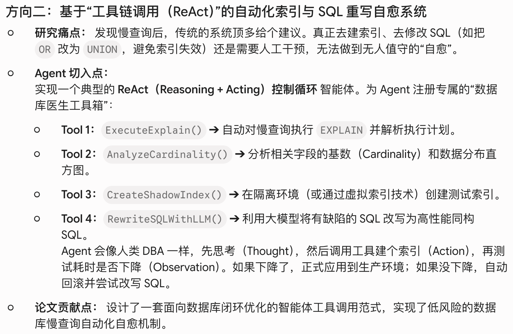

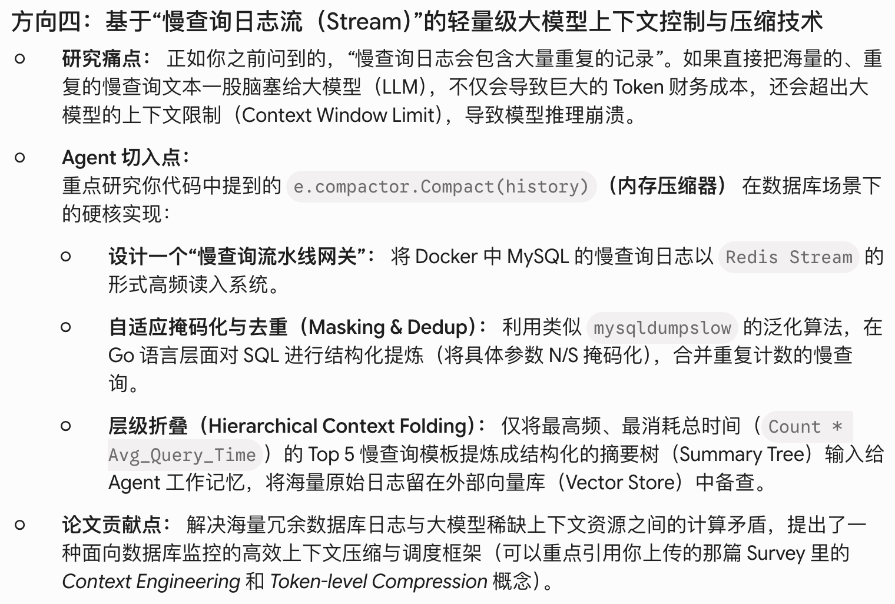

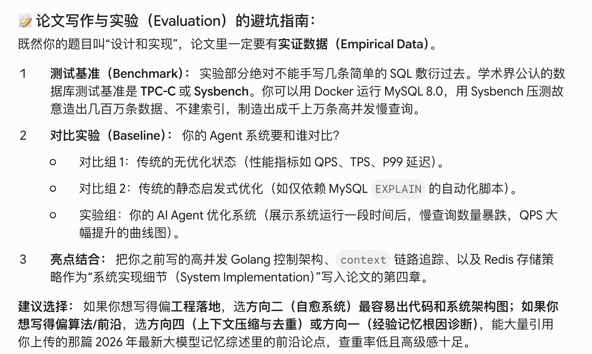

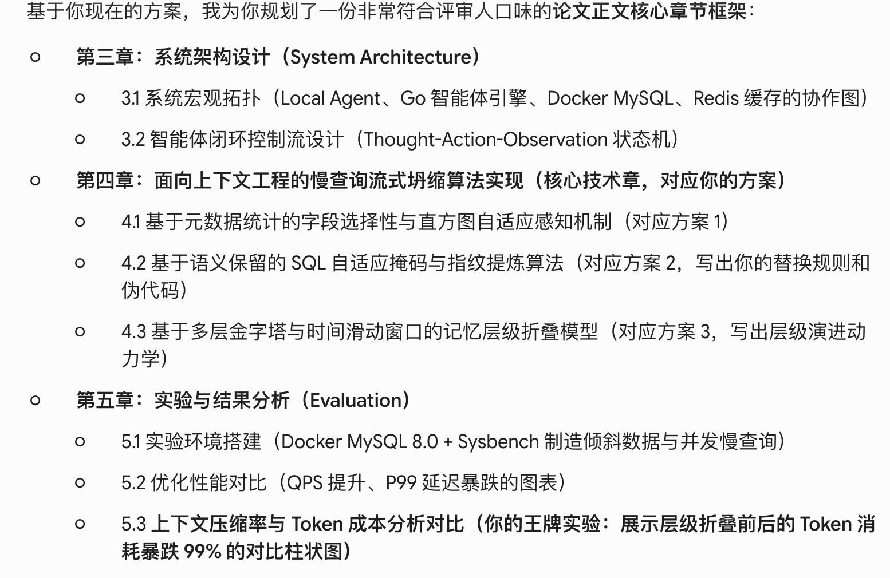

## 公式讲解

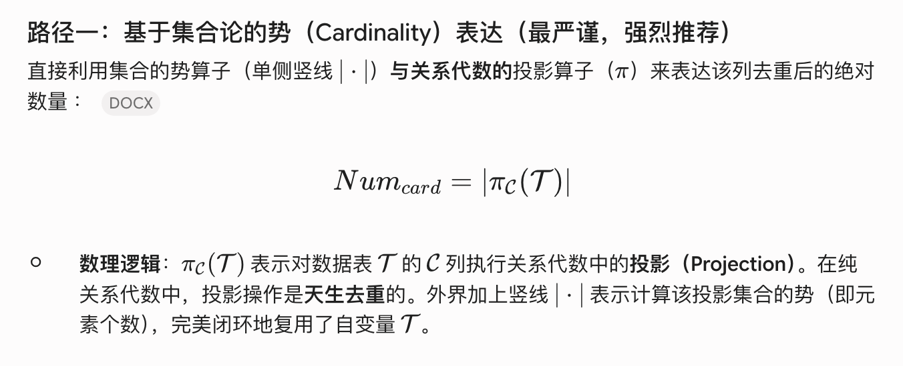

## 名词解释

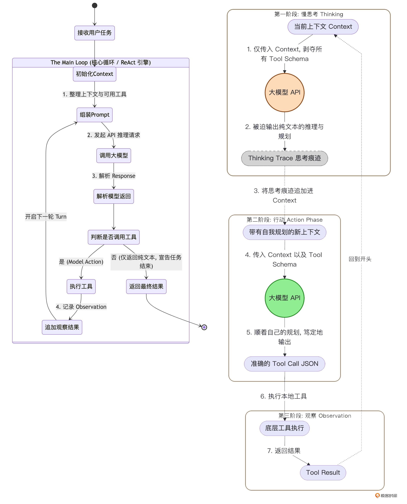

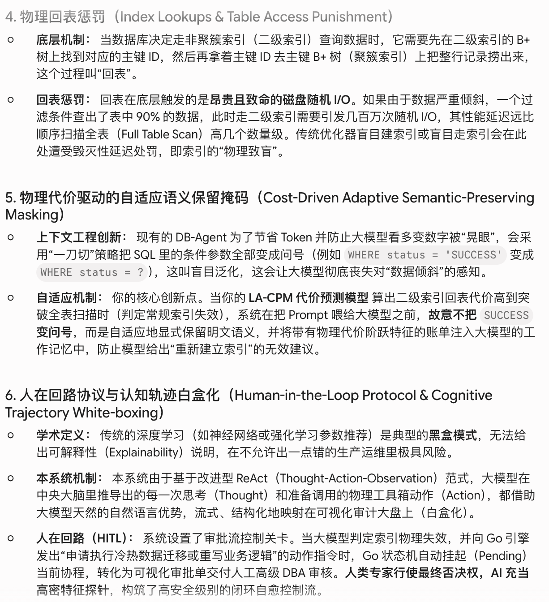

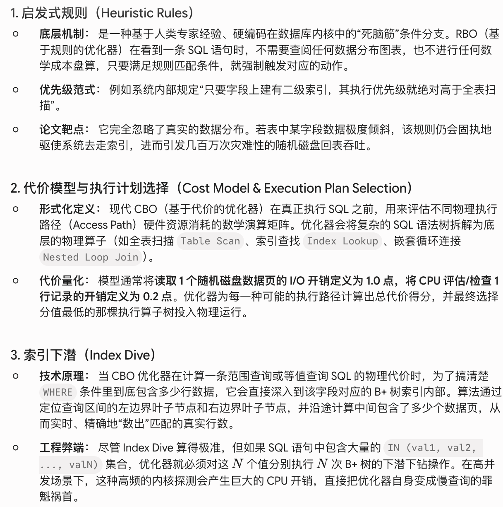

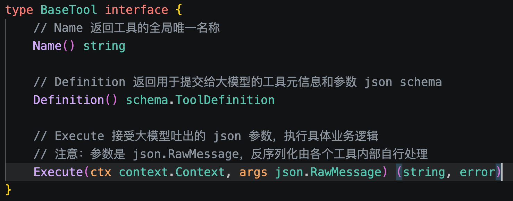

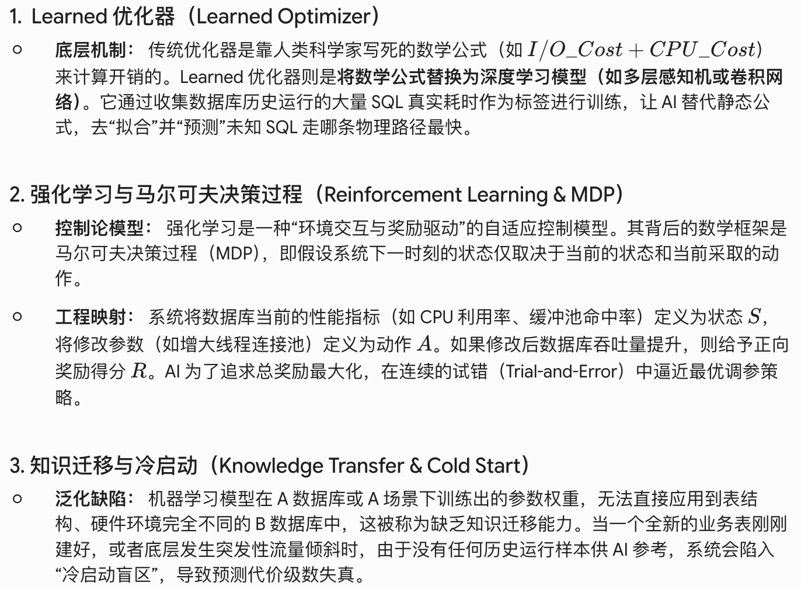

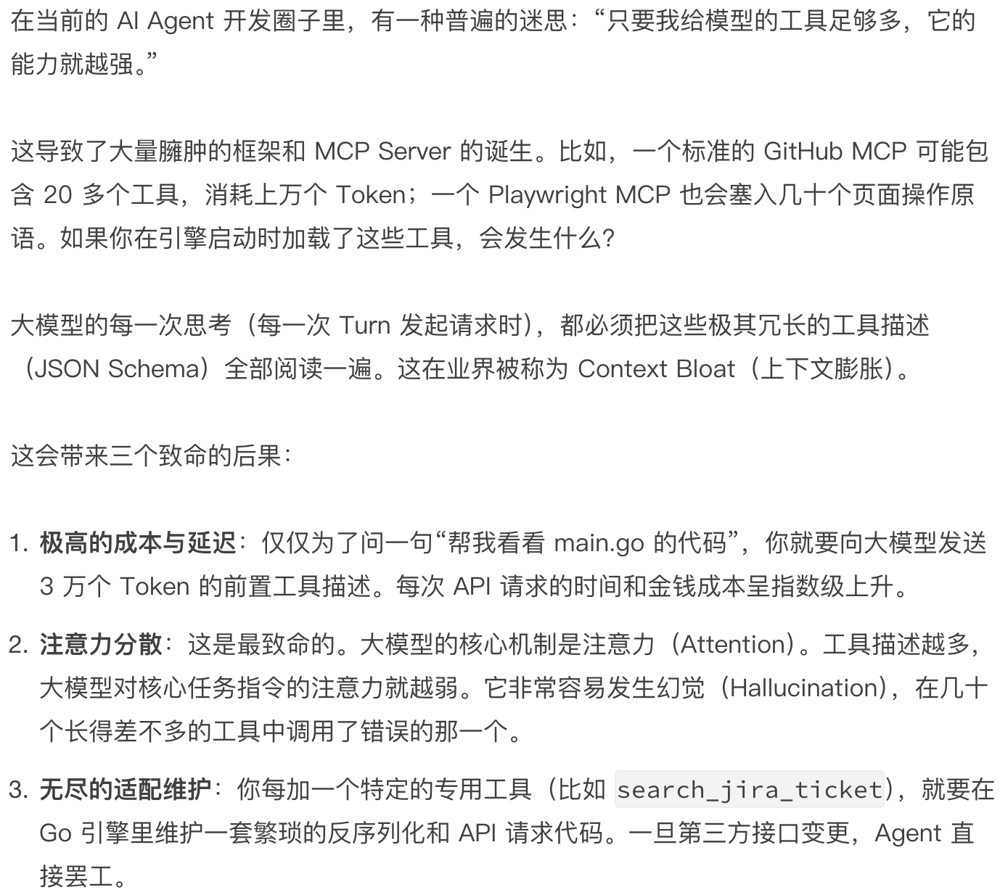

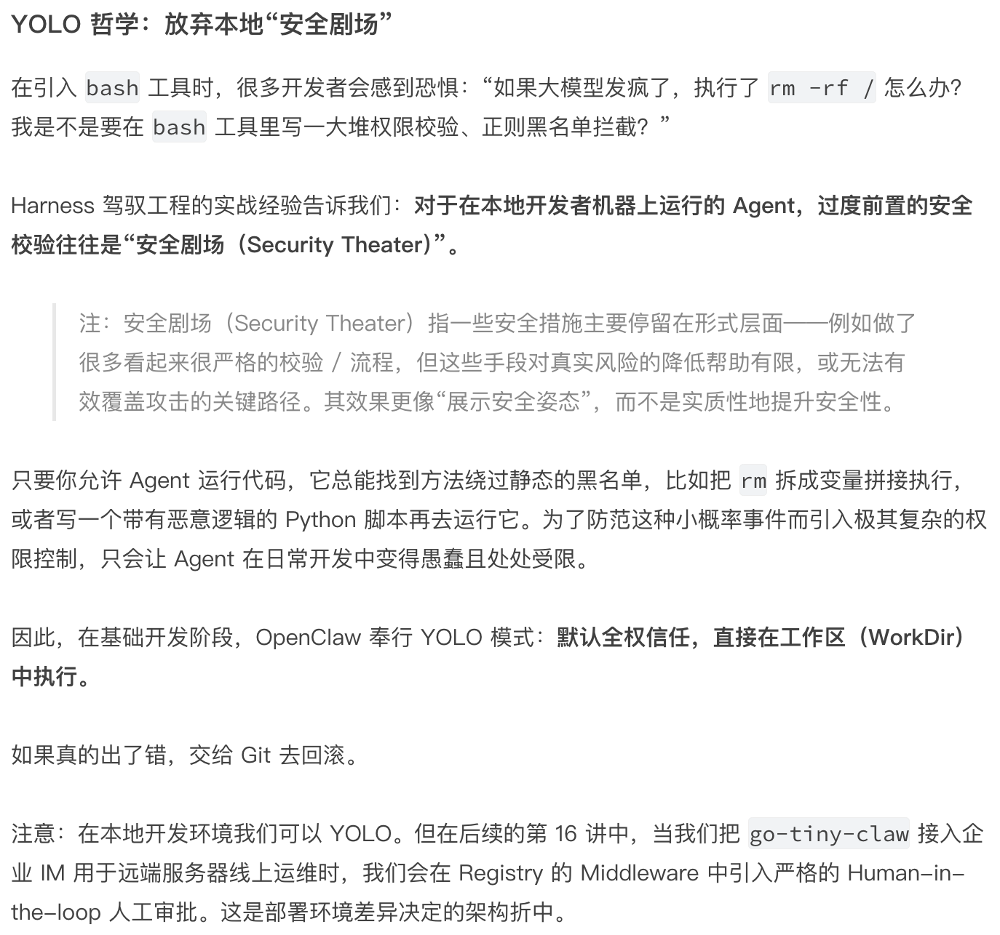

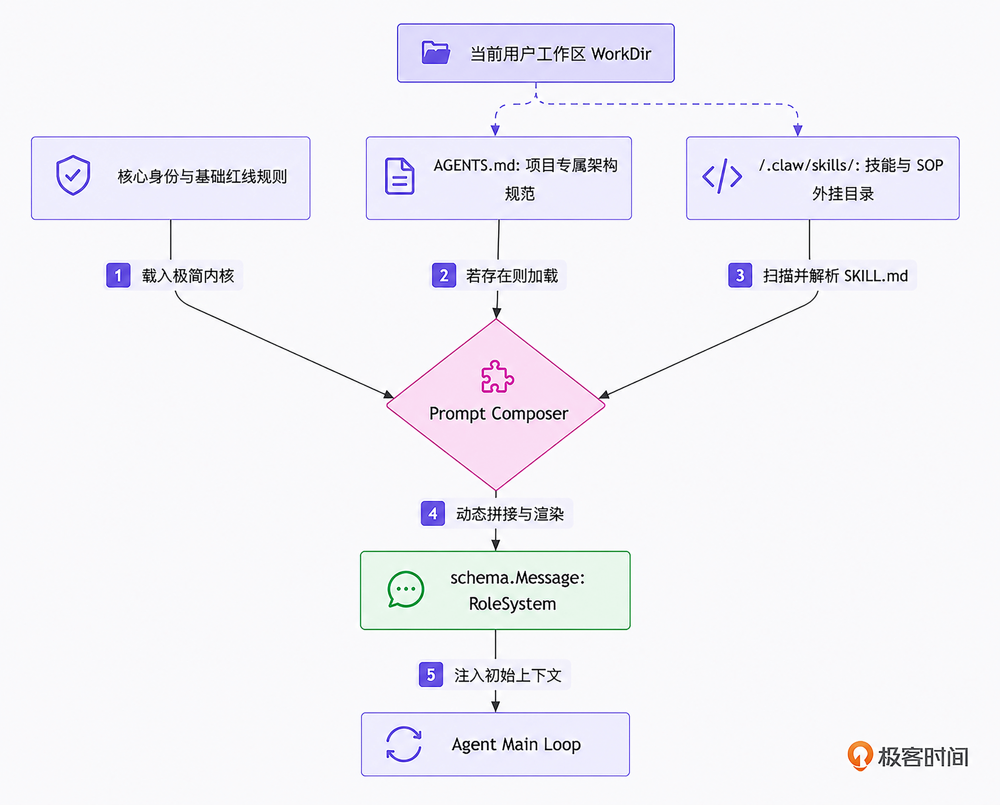

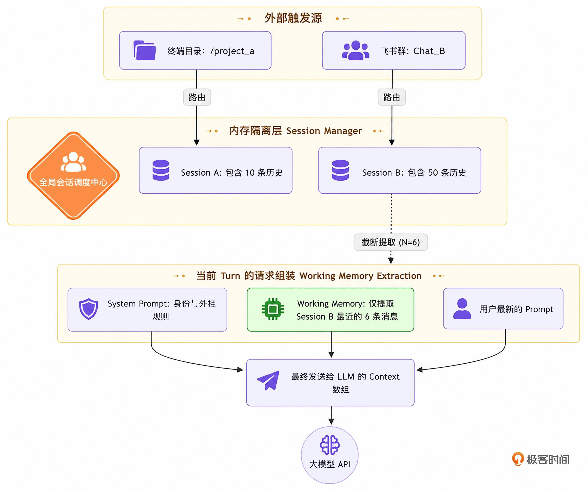

- 检查行数（Rows Examined）
检查行数是指数据库在执行该条 SQL 语句时，底层存储引擎（如 InnoDB）物理扫描并读入内存进行过滤和评估的数据总行数。它与最终返回给客户端的行数（Rows_sent）不同。当一张表缺乏高效索引或发生索引物理致盲时，即使最终只返回 1 行数据，其检查行数也可能高达数百万行。它是 CBO 优化器计算 CPU 评估代价的核心物理依据，也是判定慢查询的关键指标。
- 页缓存（Page Cache / 文件系统缓冲区）
页缓存是操作系统（OS）内核为了优化磁盘 I/O 吞吐性能而在主内存中划分的一块专属虚拟缓冲区。当应用程序（如数据库内核）向磁盘写入文件时，操作系统会前置将数据写入页缓存中并将对应的内存页标记为“脏页（Dirty Page）”，随后立即向应用程序返回写入成功响应。这种机制将高开销的磁盘物理 I/O 转化为高效的内存读写，极大地提升了系统的并发吞吐量。
- 异步冲刷（Asynchronous Flush / Writeback）
异步冲刷是指操作系统内核调度线程定期将 Page Cache 中积压的脏页数据，批量写入并固化到物理磁盘介质（如 SSD/HDD）中的过程。由于该过程与数据库主线程异步并行，因此被称为异步冲刷。这一机制虽然释放了数据库的在线算力，但天然带来了日志文本落盘的时序滞后性与物理多行拼接的不确定性。
- 追加模式（Append-only Mode）
追加模式是指一种特定的文件物理写入规范。在此模式下，新生成的日志数据永远只能流式追加到当前磁盘文件的最末尾（EOF 边界），而绝不允许对文件中已经存在的历史数据执行随机修改或复写。这种模式将昂贵的磁盘随机写入完美转化为极具性能优势的顺序 I/O 写入（Sequential I/O），是现代所有高性能数据库系统存储层和日志流的核心物理基石。
- 字段基数（Cardinality）：指数据库表中某一特定列上所有不同、非重复取值的绝对数量。基数越高（如主键 ID 或身份证号字段），代表该列的数据离散度越高；基数越低（如性别或状态字段），代表该列的重复数据密度越高。它是优化器评估索引区分度的核心基准。
- 数据选择性（Selectivity）：指表中满足特定查询过滤条件的记录行数占数据表总行数的物理比值，其数值空间严格限定在 0 到 1 之间。选择性越接近于 0，代表该过滤条件能够过滤掉绝大多数无关数据，走索引的效率极高；选择性越接近于 1，代表该条件几乎锁定了全表数据，走索引将引发灾难性的回表开销。
- 数据倾斜（Data Skew）：指数据在表中某一列的分布严重不均匀，大量记录密集集聚在少数几个特定的字面量值上（如电商系统中 99% 的订单状态均为“已完成”），而其余取值的记录数极少的物理现象。它是导致传统 CBO 优化器产生执行计划颠簸与慢查询爆发的元凶。
- 非参数化大样本重算（Non-parametric Large-sample Recalculation）：指一类不依赖任何先验统计学概率分布模型假设（如高斯分布、均匀分布），直接通过对目标数据集进行全量物理扫描与真实聚合计算，来获取无偏真实指标的计算算法。在本系统中，它专指在隔离只读分析库上对慢查询谓词执行的高吞吐、零入侵特征压榨。
- 静态硬件开销常数（Static Hardware Cost Constants）：指硬编码在数据库优化器（CBO）源码内核中、用于量化基础硬件操作开销的一组相对无量纲权重。如 MySQL 默认规定读取 1 个物理页的 I/O 代价为 1.0，CPU 检查 1 行记录的代价为 0.2。它是优化器在离线状态下评估执行计划成本的数学基准。
- 二级索引回表（Secondary Index Lookup & Table Access）：指数据库通过非聚簇索引（二级索引）检索数据时，因索引树不包含查询所需的全部字段，导致执行器必须拿着二级索引叶子节点记录的主键 ID，重新回到聚簇索引（主键 B+ 树）上通过随机查找把整行记录捞出来的物理过程。
- 顺序 I/O 与随机 I/O（Sequential I/O vs Random I/O）：顺序 I/O 是指数据在磁盘存储介质上的物理写入或读取地址是连续排列的，磁头或固态硬盘主控能够进行极高吞吐的线性流式提取，延迟极低。随机 I/O 则指数据的物理地址在磁盘上是分散、非连续的，导致磁头必须频繁寻道（机械硬盘）或引发严重的数据块擦写放大（SSD），物理延迟通常比顺序 I/O 高出一到两个数量级。
- 顺序预读机制（Read-Ahead Mechanism）：指操作系统（OS）内核或数据库存储引擎内部的一种异步 I/O 优化算法。当系统检测到应用程序正在连续、顺序读取某块磁盘区域时，会自动前置、异步地将后续相邻的若干个磁盘数据页批量一次性读入内存页缓存（Page Cache）中，从而将高开销的磁盘物理读完美转化为高效的内存预消费。
- 可观测性监控体系（Observability Monitoring System）：指一套集成在操作系统内核或数据库系统内部的高内聚指标采集、事件流追踪与日志审计的基础设施。它通过非入侵或轻量级的物理埋点，流式透传出硬件资源挤兑、线程锁等待以及存储层物理读写等宏观与微观运行特征，是智能体进行上下文感知的重要数据源。
- 基于代价的优化器（Cost-Based Optimizer / CBO）：指现代关系型数据库内核用来判定 SQL 执行路径的核心算法引擎。它通过查阅数据表的最新元数据统计信息，利用固定的数理常数公式去模拟、演算不同执行路径（如全表扫描与索引查找）所需的物理资源消耗，最终以“代价得分最低”为判定准则生成最优的执行计划。
- 访问路径（Access Path）：指数据库存储引擎为了从物理磁盘文件或主内存缓冲池中捞取满足 SQL 条件的数据记录，而在底层所采取的具体数据检索与扫描方式。典型的访问路径包括通过聚簇索引的主键查找、利用二级索引的覆盖扫描，以及当索引物理致盲或缺失时不得不退化走向的顺序全表扫描。
- 执行计划树（Execution Plan Tree）：指由数据库 CBO 优化器将一条高级声明式的 SQL 语句，经由词法语法解析、逻辑重写后，最终生成的由一系列底层物理算子（如 Table Scan、Index Scan、Filter、Sort 等）按特定依赖与拓扑顺序组合而成的二叉树形控制流逻辑。它清晰地表征了数据流在存储引擎层被物理压榨与过滤的白盒化全过程。
- 系统级上下文切换（Context Switch）：指操作系统内核为了在多核 CPU 上并发运行超越核心数量的线程任务，而在主显存中执行的撤销当前运行线程、保存其 CPU 寄存器与程序计数器（PC）状态，并加载并调度下一个就绪线程投入运行的物理过程。高频的上下文切换会产生剧烈的 CPU 缓存污染与核心算力空耗。
- 物理墙钟时间（Wall-clock Time）：区别于进程占用的 CPU 核心时间（CPU Time），是指一段物理代码或一个 SQL 算子从开始投入运行到最终闭环完成，在真实物理世界中所流逝的绝对客观时间（即人类手表上走过的时间）。它是量化高并发环境下排队延迟和 I/O 阻塞长尾效应的最真实指标。
- I/O Wait 状态变量：操作系统内核用来量化物理块设备资源饱和度的一维核心可观测性指标。它专门统计了在给定的时间窗口内，CPU 核心上没有任何处于就绪态的任务可以执行，且当前系统内至少有一个进程正因为等待磁盘、网络等外设 I/O 完成而被迫处于不可中断睡眠状态的时间百分比。
- 毒性执行计划（Toxic Execution Plan）：指在数据库运维中，由于统计信息滞后、采样失真或环境硬件资源遭遇挤兑，导致 CBO 优化器产生严重决策偏差，最终生成并投入物理运行的、在实际执行中会引发系统 CPU 锁死或磁盘 I/O 抽干崩溃的极低效执行计划树。它是现代 OLTP 系统发生高可用灾难的核心诱因。
- 旁路安全原则（Bypass Safety Principle）：指在高性能系统设计中，监控、分析与调优组件不直接串联接入核心业务流水线（如主事务处理路径），而是作为独立的旁路协程或独立物理节点运行，通过捕获日志流或离线副本进行流式演算。该原则能够确保即使调优组件发生崩溃或发生死锁，核心线上业务依然能够百分之百不受影响地平稳运行。
- 双轨时间尺度负载（Dual-track Time-scale Load）：指可观测性系统同时从微观（如 100 毫秒的高频时间窗积分）与宏观（如 1 分钟的内核加权移动平均）两个不同维度，同步抽取操作系统的硬件饱和特征。微观尺度用于灵敏捕捉瞬时的突发流量毛刺，宏观尺度用于平滑过滤偶发噪声并表征系统长期的演进趋势，两者协同能够完美防范自愈控制链条发生频繁震荡。
- 信息熵（Information Entropy）：香农信息论中用于量化系统不确定性或信息量大小的核心数学指标 。在上下文工程中，信息熵越高，意味着文本中所包含的有效、非冗余的物理特征越多 。系统的学术目标是在利用算法大幅度压缩上下文文本长度（降低语境冗余）的同时，尽可能保持总信息熵不发生非线性跌落，从而为智能体大脑提供高保真的因果推导依据。
- 控制流收敛（Control Flow Convergence）：控制论与计算机体系结构中的核心概念，指一个自动化控制系统在面对外部多变、复杂的物理环境噪声冲击时，其内部的状态机和输出动作能够始终在可控、安全、预期的物理边界内演进，而绝不会发生系统发散、死循环或引发不可预测的级联灾难反应。
- 主从异步复制（Master-Slave Asynchronous Replication）：指数据库集群中一种经典的架构数据同步机制。主库在独立线程中执行在线写事务并将变更写入二进制日志（Binlog）后，无需等待从库的确认反馈便直接向客户端返回成功；从库通过网络流式读取该 Binlog 字节流并在本地异步重放，从而在旁路维持一份高保真的数据副本。
- 行级二进制日志（Row-based Binlog）：指关系型数据库将数据变动固化到磁盘日志文件时所采用的一种高精确度格式。它不记录原始的 SQL 语句文本，而是以二进制字节码的形式精准记录每一行记录发生变更前后的真实数据快照，能够确保主从之间数据几何特征与倾斜分布的百分之百无偏差对齐。
- 连接池句柄（Connection Pool Handles）：在计算机网络与数据库体系结构中，指应用程序用来高并发复用、管理和调度一组预先创建好的物理数据库 TCP 长连接的内存逻辑控制对象。通过维护异构的池句柄，系统能够实现毫秒级的连接重用与高可靠的网络流量分流隔离。
- 元数据锁竞争（Metadata Lock Competition / MDL Lock）：指关系型数据库为了保障在线事务运行期间表结构 Schema 的强一致性，而引入的一种内核级锁机制。当有线程尝试对表执行 ALTER TABLE 或高频 ANALYZE 等结构探测时，会申请排他的元数据写锁，这在高并发 OLTP 环境下极易引发大量在线读写请求线程的长时间阻塞挂起，造成连接池爆表雪崩 。
- ReAct范式（Reasoning and Acting Paradigm）：大语言模型智能体的一种经典认知控制框架 。它通过将模型的推理生成（Thought）与工具工具箱调用（Action）紧密交织、轮流迭代，并实时观测外部物理环境的反馈信息（Observation），从而让智能体在多轮循环中具备自我反思、动态规划与纠错的能力。
- 结构化工具调用（Tool Calls）：指大语言模型超越纯文本生成、直接输出符合特定 JSON Schema 语法规范的格式化命令代码的能力 。智能体利用该机制能够精准调度外部物理工具箱（如数据库客户端、系统探针、网络组件），实现对物理世界状态的主动变更。
- CSP并发模型（Communicating Sequential Processes）：由计算机科学家霍尔提出的一种并发控制论体系架构 。其核心设计哲学在于“不要通过共享内存来通信，而要通过通信来共享内存” 。在 Go 语言的落地中，它专指利用轻量级协程（Goroutine）作为独立的顺序执行单元，并完全依赖通信通道（Channel）进行无锁的数据传递与状态同步。
- 多路复用仲裁机制（Multiplexing Select Mechanism）：指利用操作系统底层的非阻塞 I/O 复用原理（如 Go 内核中高度优化的系统调用），在单条线程或协程中同时挂起并监听多个不同的异步事件源或数据通道 。当其中任意一个通道发生数据就绪或状态阶跃时，仲裁器在纳秒级时间内精准捕获并触发对应的业务逻辑分支 。  
- CPU与I/O扰动因子（Alpha & Beta Factors）：指本系统 LA-CPM 模型内部引入的两个动态硬件开销权重因数。$\alpha$ 对应微观时间轴上的 CPU 利用率，用于动态修正内核元组检查成本；$\beta$ 对应宏观时间轴上的系统平均负载与 iowait，用于动态惩罚并放大随机回表 I/O 成本。
- 物理页数预测（Physical Page Prediction）：指系统抛弃硬编码的记录估算，联动 SchemaAnalyzer 模块逆向解析 InnoDB Compact 真实行格式（严格扣除物理页头固定 114 字节、记录头与 NULL 位图掩码），从而精准、无偏地计算出任意特定表专属的单页记录容量与总物理页数的空间反褶积算法。
- 代价临界点（Cost Critical Point）：指在动态开销演算控制流中，由于数据倾斜引发的数据选择性异常扩大，或由于系统高负载引发的随机 I/O 阻尼系数剧烈飙升，导致走二级索引回表的真实物理开销分值超越全表顺序扫描开销分值的交汇边界点。它是判定常规索引发生物理失效的核心基准。
- 语义保留掩码机制（Semantic Preservation Mask Mechanism）：指本系统独创的自适应上下文压缩策略。区别于传统一刀切泛化抹除所有参数的做法，当系统检测到慢查询越过代价临界点时，会主动在输入大模型的文本流中显式保留该谓词明文字面量，以保障大模型大脑对底层数据倾斜物理特征的因果感知力。
- 标准掩码模式（Standard Masking Mode）：指系统在上下文工程中，无差别地将所有 SQL 条件谓词中的字面量参数复写为标准问号占位符的泛化模式。其主要用于数据分布均匀、无负载风险的常规慢查询场景中，以极高压缩比提升 Token 的复用效能。
- 语义保留模式（Semantic Preservation Mode）：指本系统特有的一种高级非对称掩码模式。当 LA-CPM 模型检测到特定字面量引发了常规索引的物理失效时，系统强制在提示词中保留该明文参数，并协同注入白盒化的物理账单特征，以唤醒大模型的宏观架构自愈推理。
- 双重降级防线（Dual Degradation Defenses）：指 Compactor 内部实现的一种层级渐进式文本压缩控制流。通过将消息历史解耦为远期和近期两个窗口，远期执行“全量清理与语义折叠”，近期执行“超长局部掐头去尾截断”，从而构筑了对抗显存容量爆炸的稳健屏障。
- 超长局部截断算子（Head-Tail Truncation Operator）：一种专用于高密工具输出文本预处理的计算机体系结构级压缩算法。它基于大语言模型对文本两端信息敏感度最高的物理特性，强行切除超长文本的中间带并用标量记录省略长度，实现了文本在内存中的低成本极速收敛。
- 中央大脑认知空间（Central Brain Cognitive Space）：指系统内部基于大语言模型自注意力机制和上下文工程构建的、能够对复杂输入特征进行白盒化语义破译、因果推导与离散动作规划的软件决策层。它是连接感知层物质世界与执行层物理变更的核心纽带。
- 常识边界约束（Commonsense Boundary Constraints）：指在提示词工程中，为了杜绝通用大语言模型因概率分布输出而天生具备的非确定性幻觉风险，通过在系统角色域内嵌入严密的工业运维规范、代数关系限制及安全行为红线，强行对模型的思维流动划定严苛的物理安全边界。
- 控制收敛（Control Convergence）：控制论的核心概念，指一个自动化控制系统在面对外部多变、复杂的物理噪声冲击或非预期错误回放时，其内部的状态机、协程控制流和输出动作能够始终在可控、安全、预期的物理范围内平稳演进，而绝不会发生系统发散或死循环灾难。
- 指标回放与反馈修正（Metric Replay and Feedback Correction）：指智能体在下发某项自愈 Action 动作后，工具执行引擎在特定物理沙箱或隔离分析库上流式监控并抓取其物理指标的跳变结果，一旦判定耗时未缩短或指标发生非预期恶化，控制流将该负向反馈作为新一轮工作记忆重新反哺输入大模型，诱发其进行在线反思与策略重组。
- 常识边界约束（Commonsense Boundary Constraints）：指在提示词工程的角色域中，为了克制通用大语言模型由于其底层的自回归概率预测机制所天生带来的非确定性幻觉风险，通过强制灌输行业安全标准、物理依赖性及高危行为黑名单，从而在逻辑层面对AI思想流动的广度与边界实施严格、不可逾越的物理限制。
- 高能工作记忆（High-Energy Working Memory）：在本系统中特指经过感知层多维特征高密压榨、去除一切文本杂音（语境冗余）后，深度嵌入了操作系统负载因子与底层存储几何物理代价等强因果变量的高质量提示词上下文。它能够让大模型在极短的上下文窗口内捕捉到最高信息熵的决策依据。
- 注意力非线性退化（Lost in the Middle / Non-linear Attention Degradation）：指大规模语言模型内核的自注意力机制在处理超长、冗余的输入文本提示词时，其对文本首尾两端特征信息的检索、捕捉与敏感度极高，而对埋藏在长尾文本中间段的核心特征信息（如表结构元数据、瞬时指标）的检索能力呈现剧烈、非线性跌落的物理缺陷现象。
- 失真倍率（Cost Distortion Multiplier）：指由 LA-CPM 动态物理代价模型前置计算出的、在当前宿主机操作系统高负载干扰下，走二级索引并进行随机回表所付出的真实物理成本，相比于走全表顺序扫描物理成本的相对比值。当该倍率大于 1 时，提示常规索引已彻底发生物理失效。
- JSON Schema：一种基于 JSON 格式的声明式结构定义规范，用于强安全约束和校验数据对象的字段属性与类型。
- Tool Calls（工具调用）：大语言模型根据输入提示，自主选择并输出需要调用的外部函数名称及结构化参数对象的机制。
- SlavePool / MasterPool（从库连接池 / 主库连接池）：系统底层维护的两组完全独立的数据库连接句柄，用于分别对隔离只读分析库执行读探测路由，以及对线上生产主库执行自愈写路由。
- 指标回放：将捕获到的异常慢查询事件特征，在物理隔离的模拟沙箱环境中重新进行流式二次执行，以观测软硬件指标和执行计划变化的检测机制。
- Observation（观察）流：大模型智能体在 ReAct 推理控制闭环中，流式接收到的来自外部物理工具箱执行端或环境监控探针返回的真实物理反馈数据流。
- 软硬件堆栈：指支撑一个计算机系统或应用运行所需的、从底层物理硬件到上层操作系统、中间件及编译环境的完整层级技术架构集合。
- 选择度 (Selectivity)：数据库查询优化中的核心概念，指满足特定谓词条件的记录行数占总记录行数的比例。选择度越低，说明该条件过滤效果越好，越倾向于使用索引扫描。
- 直方图 (Histogram)：关系型数据库用于记录某一物理列中数据分布形态的统计学特征信息。若直方图缺失或未及时重算，优化器面对数据倾斜时常无法做出正确的物理执行代价推导。
- 网络拓扑 (Network Topology)：指网络中各种计算节点、设备和传输介质在物理结构或逻辑关联上的排列与连接几何形态。
- 钟墙时间 (Wall-Clock Time)：又称挂钟时间，指物理世界中事件从开始执行到结束所消耗的真实物理流逝时间。与仅计算 CPU 核心占用时间的 CPU Time 形成对比。
- 顺序 I/O (Sequential I/O)：指应用程序在物理磁盘上连续的存储块空间内进行顺序读写数据的操作，能够极大压榨文件系统的预读机制，具有极高的吞吐性能。
- 随机 I/O (Random I/O)：指应用程序下发的读写物理块地址在磁盘上是不连续、散乱分布的，在机械硬盘上会引发频繁的磁头寻道，在闪存介质上会触发块擦写延迟，是关系型数据库回表操作的主要性能瓶颈。
- 指数加权移动平均 (Exponentially Weighted Moving Average, EWMA)：一种统计学加权算法，通过对历史数据流赋予随时间非线性指数衰减的权重，用于平滑过滤瞬时流量毛刺并捕捉长期的宏观趋势收敛特征。
- 执行计划 (Execution Plan)：数据库优化器（CBO）对输入的 SQL 语句进行代价演算后，生成的由底层物理算子（如全表扫描、索引查找、嵌套循环连接）组合而成的具体物理访问路径树，直接决定了查询在存储引擎层面的资源开销。
- Docker容器化技术：一种轻量级的操作系统级虚拟化技术，允许开发者将应用及其全部依赖项打包到一个相互隔离的容器镜像中，确保应用在不同物理环境下的强一致性运行。
- 桥接网络（Bridge Network）：Docker 内置的一种软件桥接网络，允许连接到同一网络的各个容器之间进行直连通信，同时与未连接该网络的其他容器或外部物理宿主机进行网络隔离。
- 数据倾斜（Data Skew）：指分布式系统或关系型数据库中，某些特定物理列中的数据字面量取值分布严重非均匀，极少数热点值占据了海量的存储份额，导致传统的统计模型发生局部失真。
- 非参数化重算（Non-parametric Recalculation）：一种不依赖任何先验数理模型（如正态分布、均匀分布）假设，直接通过对底层物理存储介质上的大样本数据进行全量真实扫描来逼近确定性数学特征的计算范式。
- 香农信息熵（Shannon Information Theory）：信息论中用于量化系统或文本数据流中信息不确定性与平均信息密度的核心数理算子。信息熵越高，说明文本中的随机性、噪声或不重复的关键特征量越大。
- 语境冗余（Contextual Redundancy）：指在特定语境或数据流文本中，大量不为大模型分布式推理和决策生成贡献新信息熵的、重复且低信息密度的字面量噪声。
- 决策幻觉（Decision Hallucination）：指大语言模型由于输入上下文中缺乏真实物理依据的支撑，其底层的概率生成机制产生偏离物理现实、输出看似合理实则错误或具有破坏性的物理操作指令的非确定性失效现象。
- 根因破译（Root Cause Analysis）：一种旨在深入计算机系统、存储引擎或操作系统底层执行流，通过因果因数推导来寻找引发性能长尾故障或慢查询事件的最本质、最源头根源的系统化诊断范式。
- 键值缓存（KV Cache）：大语言模型在进行自回归生成解码时，为了避免对历史已生成的 Token 进行重复自注意力矩阵计算，而在显存中将每个 Token 的键（Key）和值（Value）矩阵进行持久化缓存的技术方案。随着文本增长，其会消耗海量的硬件显存资源。
- 拓扑体系（Topology Architecture）：指在计算机系统或网络工程中，各个硬件节点、软件实例、容器以及它们之间的通信链路所构成的物理或逻辑空间排列布局。
- 闭环自愈（Closed-Loop Self-Healing）：系统在无需人工干预的情况下，通过“流式监听-物理感知-大脑认知-沙箱回放-决策注入”的闭环链路，自主发现故障根因、生成修复预案并最终在线收敛消除故障的自动化控制范式。
- 物理解耦（Physical Decoupling）：指在计算机系统架构设计中，将不同的计算任务、数据流向或组件进程在物理硬件、网络拓扑或存储介质层面上进行彻底的隔离分离，消除彼此之间的资源抢占与级联干扰风险。
- 字面量（Literal）：计算机编程与关系代数中的源代码固定值，在 SQL 语句中通常表现为具体的数值（如 18）、变长字符串（如 '已完成'）或确定的时间戳，与之相对的是抽象的占位符。
- 香农信息（Shannon Information）：信息论中的核心原语，指消除事物不确定性的度量，文本数据中关键特征的保真度与剔除无用噪声后的信息密度直接由其定量表征。
- 图神经网络（GNN, Graph Neural Network）：一种直接在图结构上进行运行和特征提取的深度学习架构，能够高效将节点拓扑、边因果特征转化为高维向量。在数据库领域常用于对复合执行计划树或多表复杂代数拓扑进行高保真度编码拟合。
- 数据洗牌（Shuffle）：在分布式计算或分布式数据库系统中，各物理节点为了完成复杂的分布式聚合或跨节点关联（Join）操作，必须通过局域网络高频、高并发地将数据打碎并在网络节点之间重新进行横向数据交互与传输流转的过程。
- Learned优化器：指抛弃传统基于人工硬编码静态公式的优化路径，全面转向由数据驱动的深度学习模型、强化学习模型来流式逼近和定量预测物理执行代价或直接在线生成执行计划的数据库自调优前沿设计范式。
- 形式化推导（Formal Derivation）：学术论文写作原语，指利用严格的数学符号、公式演进体系以及逻辑代数定理，将一个抽象的系统级猜想或控制逻辑，一步步推导转化为确定性的、可被计算机编译执行的数学公式的过程。
- 形式化复用（Formal Reuse）：指系统内部的多个独立技术层级（如系统可观测性层与数理代价公式层），共享同一套标准数学变量命名与物理标量契约，以避免系统在跨层通信时产生数理意义上的歧义。
- 原位复写（In-place Overwrite）：计算机体系结构与高级语言编程范式，指程序直接在已有的某块特定内存槽位或对象句柄属性上进行数据的就地覆盖与状态更新，而不去申请新的临时内存块，用以榨干高并发系统的内存分配损耗。
- 单一真理源（Single Source of Truth, SSOT）：架构设计与软件工程核心准则，规定系统关于某一特定技术维度或时间切面下的特征数据，必须只能在一处进行权威的持久化留存与就地状态更新，防止多副本传递导致的状态冲突和信息粘连失真。
- 原位复写（In-place Overwrite）：计算机体系结构编程范式，指程序直接在已有的某块特定内存槽位或对象句柄属性上进行数据的就地覆盖与状态更新，而不去申请新的临时内存块，用以降低高并发系统的内存分配损耗。
- 欧几里得距离（Euclidean Distance）：在多维数理空间中衡量两个特征向量之间绝对几何距离的数学算子。在本系统中，用于将 $\alpha$ 与 $\beta$ 两个物理标量组合为环境负载向量，并定量计算新老事件在硬件墙阻尼上的偏离程度。
- “高密表征原则”指的是一种由底层真实物理代价（如随机 I/O 惩罚、动态负载等）反向调控、按需压缩文本信息熵的动态上下文预处理机制 。

## 代码解析

```golang
percent, err := cpu.Percent(time.Millisecond*100, false)
```

- 物理机制：cpu.Percent 函数的第一个参数设定为 time.Millisecond*100（即 100 毫秒）。
- 采样原理：探针协程在调用该方法时，会首先流式读取一次操作系统的内核 CPU Tick 计数器，随后主线程阻塞挂起 100 毫秒，到达边界后再次读取第二次 Tick 计数器。算法通过两次计数的差分演算，精确捕捉这 100ms 内的绝对 CPU 利用率。

这属于一个极短微观时间窗口内（100ms）的瞬时负载，能够非常灵敏地捕捉到突发高并发请求或密集算子挤兑带来的瞬时硬件冲击。

## 机器学习

### 无监督学习


